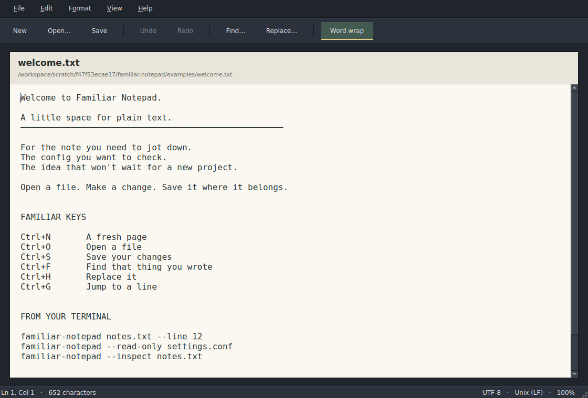

# Familiar Notepad


A little space for plain text. Familiar menus, keyboard shortcuts and native controls, with the same classic feel as Familiar Paint.

**Development preview.** Built and exercised on Ubuntu 24.04, using Qt 6.4.2's offscreen platform. Intended for Omarchy; no installed Omarchy version or live Wayland session has been tested yet. The App badge identifies the project, not official approval.



Actual Qt widget capture at 1120 × 760; offscreen, without desktop window decorations. This is a running app, not a mockup.

## Try the binary preview

There is no published release yet. Open [Build and test](https://github.com/tcballard/omarchy-apps-familiar-notepad/actions/workflows/ci.yml), select a successful run for the branch you want to try, and download its `familiar-notepad-preview-linux-x86_64` artifact (GitHub sign-in required). Unzip the artifact, then extract `familiar-notepad-0.0.1-preview-linux-x86_64.tar.gz` and open a terminal inside its folder:

```sh
sudo pacman -S --needed qt6-base qt6-wayland
sha256sum --check SHA256SUMS
./bin/familiar-notepad examples/welcome.txt
./scripts/install.sh
```

The archive contains an x86_64 Linux executable built on Ubuntu 24.04 against Qt 6.4.2; it uses your system's Qt runtime. It is not an AppImage. On the target machine, the installer checks for missing shared libraries before changing files. Live Omarchy compatibility remains to be verified.

The installer puts the executable, app launcher entry and icon under `~/.local`. It does not change your default text editor. Select **Familiar Notepad** in the launcher, or run `~/.local/bin/familiar-notepad`.

## What works

- New, open, save and save as, with prompts for unsaved changes.
- Undo/redo, cut/copy/paste, find next/previous and replace all as one undo operation.
- Case-sensitive and whole-word search, line/column navigation, word wrap, font and zoom controls.
- UTF-8, UTF-8 BOM and BOM-marked UTF-16 LE/BE; LF, CRLF and CR line endings. The status bar shows the current format; change it through Format.
- Atomic saves, file-change checks and private recovery drafts. Recover interrupted work through File → Recover drafts.
- Dark, theme-aware controls around a fixed warm paper surface. Omarchy's current `colors.toml` is checked every 2.5 seconds; there is a built-in fallback palette.

One document per window. Launch another process for another file. This preview has no tabs, printing, rich text, syntax highlighting, line-number gutter or single-instance routing.

## Terminal and agent use

```sh
familiar-notepad notes.txt
familiar-notepad notes.txt --line 12 --column 3
familiar-notepad --read-only settings.conf
familiar-notepad --inspect notes.txt
familiar-notepad --help
```

`--inspect` prints JSON containing path, encoding, line endings, character/line counts and SHA-256. It works without a display server, returning 0 for success, 1 for file errors and 2 for invalid arguments. Character counts and columns use Qt's UTF-16 positions, so an emoji can occupy two positions. Out-of-range positions are clamped to the document.

Agents can inspect a file and open it at a known position. This preview does not expose remote GUI control or a command to modify an already-open buffer. If an agent changes an open file on disk, saving the old buffer is refused; reopen it or save a separate copy.

## File safety and recovery

Files are limited to 8 MiB. Invalid UTF-8, unmarked legacy encodings, binary NULs, Unicode paragraph/line separators and mixed line endings are rejected with an explanation. No automatic lossy conversion is performed. UTF-16 requires a BOM. Files containing only one line without a terminator default to LF.

Writes use `QSaveFile` with direct-write fallback disabled. SHA-256 is checked before writing and again before commit. Cooperative app instances also use an adjacent lock file. An unrelated writer can still race the final atomic rename; these checks are not a filesystem transaction across applications. Save as lets you preserve both versions. Existing symbolic links are resolved when opened; saving directly to a symlink path is refused. Atomic replacement can break hard links and does not promise preservation of extended metadata or ACLs.

After one second of inactivity, unsaved text is copied to the app's private recovery directory, normally `~/.local/share/Familiar/familiar-notepad/recovery`. Recovery snapshots are plaintext, are bounded by the preview limit and are local to this machine. An interruption before the debounce finishes can lose the most recent edits. Save or intentionally discard the document to remove its draft. Running instances' drafts are locked and excluded from recovery selection. Restoring a draft never writes the original file automatically.

## Build from source

On Omarchy/Arch:

```sh
sudo pacman -S --needed base-devel git cmake ninja qt6-base qt6-wayland
git clone https://github.com/tcballard/omarchy-apps-familiar-notepad.git
cd omarchy-apps-familiar-notepad
cmake -S . -B build -G Ninja -DCMAKE_BUILD_TYPE=Release
cmake --build build --parallel 2
QT_QPA_PLATFORM=offscreen ctest --test-dir build --output-on-failure
./build/familiar-notepad examples/welcome.txt
./scripts/package-preview.sh
```

C++17, CMake 3.22+ and Qt 6.4+ Widgets/Concurrent are required. Qt Test is used when `BUILD_TESTING=ON` (the default). No Python, webview or network service. The [GitHub workflow](https://github.com/tcballard/omarchy-apps-familiar-notepad/actions/workflows/ci.yml) builds, tests, validates the desktop entry and uploads an installable preview. See the run itself for its current result.

## Remove or roll back

```sh
./scripts/uninstall.sh
```

Uninstall removes only the executable, its `.previous` backup, desktop entry and icon. Your documents and recovery drafts remain. Set `FAMILIAR_INSTALL_PREFIX=/absolute/path` consistently for a custom install/uninstall location, including paths with spaces.

Upgrading with the installer preserves the previous executable as `~/.local/bin/familiar-notepad.previous`. Close the app, then restore it with:

```sh
cp ~/.local/bin/familiar-notepad.previous ~/.local/bin/familiar-notepad
```

Keep the previous archive if you also want to restore its icon or desktop metadata. No recovery-data migration is required for this initial format.

See [verification](docs/VERIFICATION.md), [architecture](docs/ARCHITECTURE.md) and [credits](CREDITS.md). MIT licensed.
